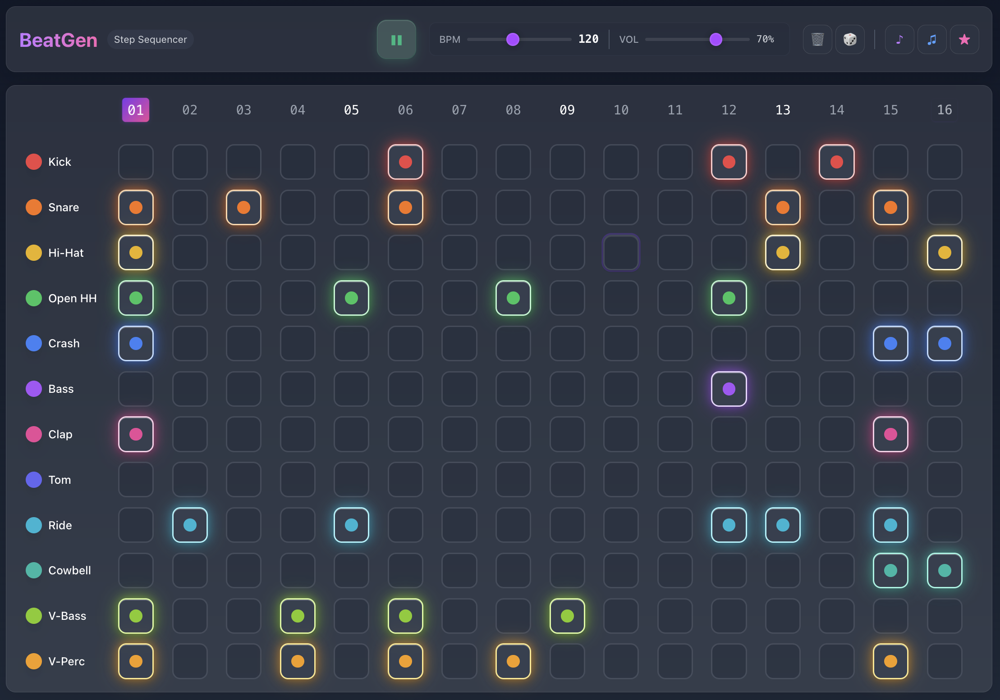

# 🎵 BeatGen - Step Sequencer

A modern, web-based step sequencer built with TypeScript and the Web Audio API. Create beats using 12 programmatically generated drum sounds with an intuitive 16-step pattern interface.

## 🌐 Live Demo

**[Try BeatGen →](https://appunni.github.io/beatgen/)**

## 📸 Screenshot


*Modern step sequencer with 12 drum tracks, 16-step patterns, and real-time visual feedback*

## ✨ Features

- **12 Unique Drum Sounds**: All generated programmatically using Web Audio API
  - Kick, Snare, Hi-Hat (Open & Closed)
  - Crash, Ride, Tom (High, Mid, Low)
  - Clap, Shaker, Rim Shot
- **16-Step Pattern Sequencer**: Classic drum machine layout
- **Real-time Controls**: 
  - Play/Pause functionality
  - Adjustable BPM (60-200)
  - Master volume control
  - Individual track volume and mute
- **Modern UI**: Beautiful glass-morphism design with Tailwind CSS
- **Visual Feedback**: Active step highlighting and responsive animations
- **Pattern Management**: Clear patterns and individual track controls

## 🚀 Getting Started

### Prerequisites

- Node.js (v16 or higher)
- npm or yarn package manager

### Installation

1. Clone the repository:
```bash
git clone https://github.com/appunni/beatgen.git
cd beatgen
```

2. Install dependencies:
```bash
npm install
```

3. Start the development server:
```bash
npm run dev
```

4. Open your browser and navigate to `http://localhost:5173`

### Building for Production

```bash
npm run build
```

The built files will be in the `dist` directory.

## 🎛️ How to Use

1. **Start the Sequencer**: Click "Start Making Beats" to initialize the audio engine
2. **Create Patterns**: Click on the grid to activate/deactivate steps for each track
3. **Play Your Beat**: Use the play button to start/stop playback
4. **Adjust Settings**:
   - Use the BPM slider to change tempo (60-200 BPM)
   - Adjust master volume with the volume slider
   - Use individual track controls for fine-tuning
5. **Clear Patterns**: Use the "Clear All" button to reset all patterns

### Keyboard Shortcuts

- `Spacebar`: Play/Pause
- `C`: Clear all patterns

## 🔧 Technical Details

### Architecture

The project is built with a modular architecture:

- **`StepSequencer`**: Core sequencer logic and timing
- **`SoundGenerator`**: Web Audio API sound synthesis
- **`UI`**: User interface and event handling
- **`main.ts`**: Application entry point

### Sound Generation

All drum sounds are generated programmatically using the Web Audio API:

- **Kick**: Low-frequency sine wave with pitch and amplitude envelopes
- **Snare**: Filtered white noise with sharp attack
- **Hi-Hats**: High-frequency noise with different decay times
- **Cymbals**: Complex harmonic synthesis
- **Toms**: Tuned sine waves with resonant decay
- **Percussion**: Various noise and tone combinations

### Tech Stack

- **TypeScript**: Type-safe JavaScript development
- **Vite**: Fast build tool and development server
- **Tailwind CSS**: Utility-first CSS framework
- **Web Audio API**: Native browser audio synthesis
- **Modern ES Modules**: Clean, modular code structure

## 🎨 Customization

### Adding New Sounds

To add a new drum sound, edit `src/soundGenerator.ts`:

1. Create a new generation method:
```typescript
generateNewSound(): AudioBuffer {
  // Your sound generation logic here
}
```

2. Add it to the sound configs array:
```typescript
{
  name: 'New Sound',
  color: 'bg-blue-500',
  generate: (ctx) => this.generateNewSound()
}
```

### Modifying Patterns

The sequencer uses a 12×16 pattern matrix. To change the number of tracks or steps, modify the initialization in `src/stepSequencer.ts`.

### Styling

The UI uses Tailwind CSS with custom glass-morphism effects. Modify `src/style.css` for global styles and the component templates in `src/ui.ts` for layout changes.
